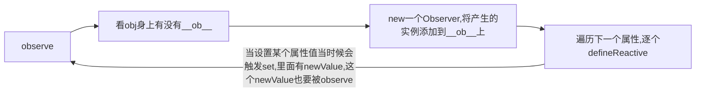
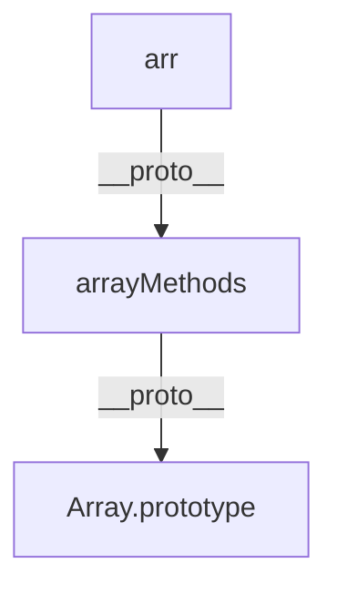

## Vue2源码解析

### 1.虚拟DOM和diff算法

虚拟DOM:用JS对象描述DOM的层次结构,DOM中一切属性都在虚拟DOM中有对应的属性

diff是发生在虚拟DOM上的，新虚拟DOM和老虚拟DOM进行diff（精细化比较），算出如何最小量更新，最后反应到真实DOM上

#####1.虚拟DOM如何被渲染函数(h函数)产生

dom变成虚拟dom属于模板编译的范畴，例如mustache,此处不涉及

h函数用来产生虚拟节点（vnode），使用patch函数将h函数生成的虚拟节点生成挂载到真实DOM树上

代码如下:

```javascript
// snabbdomStudy/src/index.js
import {
    init,
    classModule,
    propsModule,
    styleModule,
    eventListenersModule,
    h,
} from "snabbdom";

// 创建patch函数
const patch = init([classModule, propsModule, styleModule, eventListenersModule])

// 创建虚拟节点
var myVnode1 = h('a', 
{ props: 
    { 
        href: 'https://m.58tg.com/mx/dalu/nu/wangyijin/254056.html',
        target: '_blank'
    } 
}, 
'王艺谨')

// 通过patch函数让h函数创建的虚拟节点渲染到真实DOM树上
const container = document.getElementById('container')
patch(container, myVnode1)
```

**h函数还可以嵌套使用，用以生成虚拟dom**

```javascript
//在上述代码中创建一个新的Vnode
var myVnode2 = h('ul', [
        h('li', {}, '刘亦菲'),
        h('li', '王楚然'),
        h('li', [
            h('div', [
                h('p', '王艺瑾'),
                h('p', '赵粤')
            ]),
        ]),
        h('li', '程潇')
    ]
)
const container = document.getElementById('container')
patch(container, myVnode2)
```

**手写h函数(低配版)**

```javascript
// vnode.js
// 函数功能很简单，就是把传入的5个参数合并成对象返回
export default function (sel, data, children, text, elm) {
    return {
        sel, data, children, text, elm
    }
}

// h.js
import vnode from './vnode'

// 编写一个低配版的h函数，这个函数接受三个参数，缺一不可
// 意味着这个函数的重载能力很弱
// 调用的函数必须是下面三种的一种
// 1.h('div', {}, '文字')
// 2.h('div', {}, [])
// 3.h('div', {}, h())
// 完整体:sel, data, children, text, elm
export default function(sel, data, c){
    if (arguments.length !== 3) {
        throw new Error('参数必须要三种！,当前是低配版h函数')
    } else if (typeof c === 'string' || typeof c === 'number') {
        // 形态1
        return vnode(sel, data, undefined, 'c', undefined)
    } else if (Array.isArray(c)) {
        // 形态2
        // 遍历c，收集children
        let children = []
        for (let i = 0; i < c.length; i++) {
            // c[i]必须是一个对象
            if (!(typeof c[i] === 'object' && c[i].hasOwnProperty('sel'))) {
                throw new Error('传入的数组参数中有项不是h函数')
            }
            // 此处不需要执行c[i]，因为h函数自身会执行的
            // 此时只需要收集到对应的项就行
            children.push(c[i])
        }
        // 循环结束，说明children收集完毕，
        return vnode(sel, data, children, undefined, undefined)
    } else if (typeof c === 'object' && c.hasOwnProperty('sel')) {
        // 形态3
        let children = [c]
        return vnode(sel, data, children, undefined, undefined)
    } else {
        throw new Error('传入的三个参数类型不对')
    }
}

// index.js
// 测试用例
import h from './mysnabbdom/h';

var myVnode1 = h('div', {}, [
    h('p', {}, 'xixi'),
    h('p', {}, 'haha'),
    h('p', {}, 'hehe'),
    h('p', {}, h('span', {}, 'wangchuran'))
])
console.log(myVnode1);
```


##### 2.diff算法原理


##### 3.虚拟DOM如何通过diff变成真正的DOM的


### 2.响应式原理

##### 1.基础实现

通过Object.defineProperty对对象的属性设置getter和setter函数，从而实现对对象属性的数据劫持，（数据劫持即为访问或操作对象属性时必须经过get和set函数）。

具体的操作是定义一个闭包函数，名为defineReactive函数，将Object.defineProperty对属性设置get和set的操作包起来，形成一个闭包，并且外部函数defineReactive中定义一个参数val为中间量，用于传递对象属性的属性值，方便get和set，之所以用闭包，是因为每个属性会单独创建一个defineReactive实例的时候，并且val作为中间量被get和set访问后，会常驻当前属性的执行环境的内存，val不会被销毁（除非手动销毁），val是独立的，因此也可以被访问和修改。

综上所述，这就形成了响应式原理的基础的过程

```javascript
function defineReactive(obj, key, val) {
  Object.defineProperty(obj, key, {
    get(){
      return val;
    }
    set(newVal){
    	if(val === newVal){
        return;
      }
    	val = newVal;	
  	}
  })
}
```

但是上述方案只能对第一层的Object进行响应式设置，深层次的无法覆盖到，这时候就需要Observer类出场了。

##### 2.递归侦测对象全部属性

对象实现响应式的递归的流程：



```javascript
//以下为简略代码实现，具体请看vue源码
function Observe(value){
  if(typeof value !== object) return;
  if(value.__ob__){
    return value.__ob__
  }else{
    return new Observer(value)
  }
}

class Observer{
  constructor(value){
    // 给实例(this,一定注意，构造函数的this不是类本身，而是表示实例)添加了__ob__属性，值是这次new的实例
   	def(value, '__ob__', this, false);
    this.walk(value);
  }
	//遍历对象的属性
	walk() {
    for(let key in value){
      defineReactive(value, key)
    }
  }
}

function defineReactive(obj, key, val){
  if(arguments.length === 2){
    val = obj[key]
  }
  
  Object.defineProperty(obj, key, {
    get(){
      return val;
    }
    set(newVal){
      val = newVal;
      //当设置了新值，新值也要被observe
      childObj = Observe(newVal)
    }
  })
}
```

以上流程是类循环的递归方式

#####3.数组的响应式处理

基本可以概括为，Vue2以Array.prototype为原型，创建了一个arrayMethods对象(arrayMethods.__proto__ === Array.prototype)，然后用一个非常强硬的手段Object.setPrototypeOf(arr, arrayMethods)使得创建的数组的__proto__指向arrayMethods对象(arr.__proto__ = arrayMethods)，arrayMethods对象上有新的基于原生的数组的方法(push, pop,shift,unshift,sort,splice,reverse)，至此vue2中的数组调用的都是arrayMethods中的新的数组方法

而在上述原来对象的响应式处理中，添加对数组的判断和响应式处理，对数组也要进行遍历，observe其每一个值，如果遇到其中值为数组或者对象的话，再递归循环对其进行响应式处理



```javascript
// array.js
// 备份原来的数组方法
const arrayProto = Array.prototype
//基于原生数组方法创建一个arrayMethods对象并暴露
export const arrayMethods = Object.create(arrayproto)
//记录原来的方法名
const methodsToPatch = [
  'push',
  'pop',
  'shift',
  'unshift',
  'splice',
  'sort',
  'reverse'
]
// 
methodsToPatch.forEach(methodName => {
  //缓存原来的方法,因为原来方法的功能不能被剥夺
  const original = methodName
  //定义新方法
  def(arrayMethods, methodName, function(){
    // 只是original直接调用的话，会报错，因为环境是window
    // 也不能用箭头函数，this指向会被改变
    // this指的是未来执行时的环境，即将来调用它的数组，arguments是传进来的参数，例如push进来的值
    original.apply(this, arguments)
    
  },false)
})
```

```javascript
//Observer.js
class Observer{
  constructor(value){
    // 给实例(this,一定注意，构造函数的this不是类本身，而是表示实例)添加了__ob__属性，值是这次new的实例
    // observer上的__ob__我的理解是，一个被观察的标记，谁有__ob__属性就表示已经被观察了，也就是进行了响应式的处理
   	def(value, '__ob__', this, false);
    //判断是数组还是对象
    if(Array.isArray(value)){
      //如果是数组就将这个数组的原型指向arrayMethods
      Object.setPrototypeOf(value, arrayMethods)
      //让数组也遍历的observe
      this.observeArray(value)
    }else{
      this.walk(value)
    }
  }
	//遍历对象的属性，执行defineReactive
	walk(value) {
    for(let key in value){
      defineReactive(value, key)
    }
  }
  //数组的特殊遍历
  observeArray(value){
    //保留value的原始长度，防止遍历过程中数组长度变化
    for(let i = 0; l = value.length; i < l; i++){
      observe(value[i])
    }
  }
}
```

